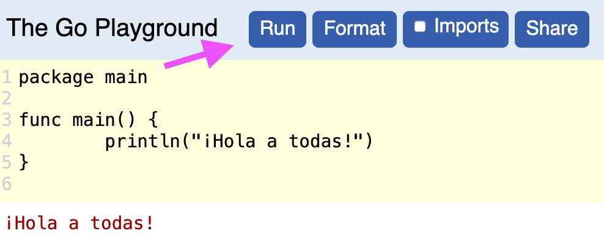
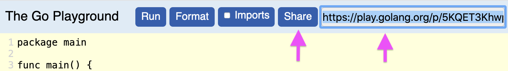

# Introducción a programación con Go

En este reto aprenderemos sobre los fundamentos de la programación.

Para poder comunicarnos con las computadoras y que estas sigan las instrucciones que nosotras les damos, es necesario hablar en el idioma de las computadoras.

Las computadoras nos entienden cuando utilizamos un lenguaje de programación. Existen muchísimos lenguajes de programación (¡como 700! :scream:), pero en esta ocasión solo aprenderemos uno, Go, que fue creado en el 2009 por Google y se le conoce entre los cuates como Golang :wink:.

Existen muchas apps y programas escritos con Go, algunos ejemplos de compañías interesantes que usan Go son: Netflix, Uber, Facebook, Twitter, Dropbox, entre otros.

Go es un proyecto de código abierto, esto es llamado "Open Source Software" y se refiere a un tipo de software donde existe una colaboración de muchas personas para mejorar el programa, además del hecho de acceder a este de forma gratuita.

## Requisitos

- Computadora, tablet o smart phone.
- Conexión a internet.

## Reto crea una calculadora

### Antes de iniciar conozcamos "Go playground"

Para todas las actividades del reto usaremos el "Go playground",  que es un ambiente (sito web) el cual nos permite correr el programa conformado por las líneas de código que escribirás tú, a través en un navegador y sin la necesidad de instalar nada en tu computadora, tablet o teléfono.

Para usarlo sigue estas instrucciones:

- Hazle click a este [enlace](https://play.golang.org/p/5KQET3Khwpi).
- Como verás hay 4 botones azules en el lado superior derecho. En este reto solo utilizaremos dos, "Run" y "Share".
- El botón "Run", que significa correr (como correr tu programa), ejecutará las instrucciones que tu hayas escrito. Hazle click al botón "Run" y verás como en la parte inferior de la pantalla te sale un saludo en letras rojas.

Ahora en la parte amarilla cambia la frase "¡Hola a todas!" por lo que tu quieras, como por ejemplo "Me gusta programar". ¡Y ve lo que pasa! Es muy importante que no quites las comillas cuando cambies la frase, por que si no te dará un error.
- El botón "Share", que significa compartir, te dará un enlace para que puedas compartir tu trabajo. Hazle click al botón "Share" y verás como te sale un enlace al lado del botón que puedes copiar y así compartir tu programa.

Una vez que copies el enlace que te salió al lado del botón "Share", abre una ventana nueva en tu navegador y verás como se abre nuevamente el programa que hiciste previamente.

### ¡Manos a la obra!

Esta es la actividad principal del reto. Crearás una calculadora y al mismo tiempo aprenderás sobre las variables y las funciones que son los fundamentos de cualquier programa.

Haz click [aquí](calculadora/README.md) para empezar el reto de la calculadora. ¡Suerte!

### ¿Qué es un Gopher?

Gopher significa tuza en inglés. ¡A toda la gente que programa usando Go les llamamos gophers!

Ahora que ya aprendiste sobre variables, funciones y creaste tu calculadora. ¡Tú también eres una programadora de Go!
Es muy importante que tengas a tu propio gopher para que te acompañe en esta aventura :)

Este es un gopher que creamos nosotras. Se llama Panchita.

Apresúrate a entrar a la página de [gopherize.me](https://gopherize.me/), y crea a tu propio gopher. Aquí te esperará Panchita con su cafesito.

## Enlaces

Si aún quieres aprender más, visita la [guía oficial de Go](https://gotour-es.appspot.com/#1). Es un poco más avanzado. ¡Pero no imposible!

_Ilustraciones de [Renee French](http://reneefrench.blogspot.com.au/) y [Ashley McNamara](https://github.com/ashleymcnamara/gophers)_.
