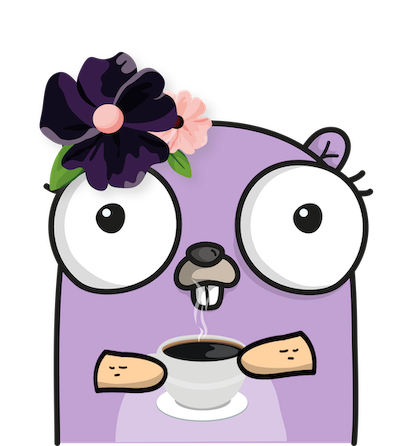

# Introducción a programación con Go

En este reto aprenderemos sobre los fundamentos de la programación.

Para poder comunicarnos con las computadoras y que estas sigan las instrucciones que nosotras les damos, es necesario hablar en el idioma de las computadoras.

Las computadoras nos entienden cuando utilizamos un lenguaje de programación. Existen muchísimos lenguajes de programación (¡como 700! :scream:), pero en esta ocasión solo aprenderemos uno, Go. Existen muchas apps y programas escritos con Go. ¡Como Uber!

## Requisitos

- Computadora, tablet o smart phone.
- Conexión a internet.

## Reto

Para todas las actividades del reto usaremos el "Go playground". Este es un programa que nos permite correr programas que escribas tu, en un navegador sin la necesidad de instalar nada en tu computadora, tablet o teléfono.

Para usarlo sigue estas instrucciones:

- Hazle click a este [enlace](https://play.golang.org/p/5KQET3Khwpi).
- Como verás hay 4 botones azules en el lado superior derecho. En este reto solo utilizaremos dos, "Run" y "Share".
- El botón "Run", que significa correr (como correr tu programa), ejecutará las instrucciones que tu hayas escrito. Hazle click al botón "Run" y verás como en la parte inferior de la pantalla te sale un saludo en letras rojas.

Ahora en la parte amarilla cambia la frase "¡Hola a todas!" por lo que tu quieras, como por ejemplo "Me gusta programar". ¡Y ve lo que pasa! Es muy importante que no quites las comillas cuando cambies la frase, por que si no te dará un error.
- El botón "Share", que significa compartir, te dará un enlace para que puedas compartir tu trabajo. Hazle click al botón "Share" y verás como te sale un enlace al lado del botón que puedes copiar y así compartir tu programa.

Una vez que copies el enlace que te salió a lado del botón "Share", abre una ventana nueva en tu navegador y verás como se abre nuevamente el programa que hiciste previamente.

### Crea una calculadora

Esta es la actividad principal del reto. Crearás una calculadora y al mismo tiempo aprenderás sobre las variables y las funciones que son los fundamentos de cualquier programa.

Haz click [aquí](calculadora/README.md) para empezar el reto de la calculadora. ¡Suerte!

### ¿Qué es un Gopher?

Gopher significa tuza en inglés. ¡A toda la gente que programa usando Go les llamamos gophers!

Ahora que ya aprendiste sobre variables, funciones y creaste tu calculadora. ¡Tu también eres una programadora de Go!
Es muy importante que tengas a tu propio gopher para que te acompañe es esta aventura :)

Este es un gopher que creamos nosotras. Se llama Panchita.

Corre a la página de [gopherize.me](https://gopherize.me/), y crea a tu propio gopher. Aquí te esperará Panchita con su cafesito.

<!-- ### Condicionales y bucles (actividad extra no obligatoria)

Si terminaste los retos anteriores y te quedaste con ganas de aprender más, checa este reto para aprender sobre condicionales y bucles. Al final podrás ver lo que se puede crear con los cuatro elementos que se han aprendido.

Haz click [aquí](arbol/README.md) para comenzar la actividad extra.
-->

## Enlaces

Si aún quieres aprender mas, visita la [guía oficial de Go](https://gotour-es.appspot.com/#1). Es un poco mas avanzado. ¡Pero no imposible!

_Ilustraciones de [Renee French](http://reneefrench.blogspot.com.au/) y [Ashley McNamara](https://github.com/ashleymcnamara/gophers)_.
