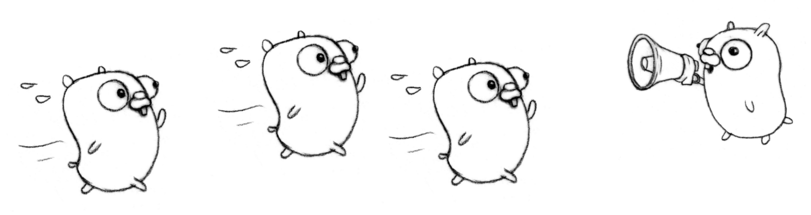
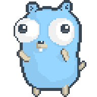

# Crea un arbolito de navidad con Go

Al final del taller habrás aprendido sobre bucles y escrito un programa que genera un arbolito de navidad. ¡Empecemos!


## Bucles

Es muy común que cuando estés programando necesites repetir una operación muchas veces. Con las herramientas que hemos aprendido hasta ahora, si quisiéramos imprimir la palabra "hola" 5 veces tendríamos que escribirlo de la manera siguiente:

```go
    println("Hola")
    println("Hola")
    println("Hola")
    println("Hola")
    println("Hola")
```

¡Sigue este [enlace](https://play.golang.org/p/N2Z8GYC1ipH) para ir al Go playground y ver este código en acción!

Muchas veces cuando escribes programas tienes que repetir la misma acción miles de veces. Imagínate lo complicado que sería tener que repetir el mismo bloque de código tantas veces :weary:. ¡Afortunadamente tenemos los bucles al rescate!

La acción de repetir algo en informática, se llama iteración. En Go se representa de la siguiente manera:

```go
    for i := 1; i <= 5; i++ {
        println("Hola")
    }
```

La palabra "for" en inglés significa "para" así que cuando empezamos un bucle es como decir "**Para** cada elemento haz...".

¿Y qué significa `i := 1; i <= 5; i++`? :confounded:.

Recuerda que a las variables se les puede cambiar el valor que tienen. La primera acción es asignarle un valor de `1` a la variable `i` (`i := 1`), esta variable nos va a servir para guardar la cuenta de cuántas veces hemos realizado la acción que estamos repitiendo.

Ahora vamos a definir cuantas veces queremos que se repita la acción. Si queremos repetir la acción 5 veces, lo que queremos decir es: "Mientras `i` tenga un valor menor o igual a `5`". Esto se representa de la siguiente manera `i <= 5`.

¿Y `i++`? En Go si le quieres sumar 1 a una variable que contenga un número sólamente tienes que agregarle un `++` a tu variable. Así que `i + 1` es lo mismo que `i++`.

¡Ahora ya aprendiste sobre bucles! Ve cómo funciona el código de arriba siguiendo este [enlace](https://play.golang.org/p/B4LNJHQLK6B).



## ¡Empecemos a crear el arbolito!

Para crear un arbolito a base de caracteres, lo primero que vamos a hacer es visualizar cómo queremos que se vea :thinking:.

```console
          *
          ^
         ^^^
        ^^^^^
       ^^^^^^^
      ^^^^^^^^^
          "
```

¿Cuales son los elementos de este arbolito? Pues una `*`, muchas `^`, una `"` y un montón de espacios para poder acomodar los caracteres.

El segundo paso es ver cual es la acción principal para crear al arbolito. Si lo hicieras con tu teclado, ¿Cómo lo harías?

Nosotras presionaríamos la tecla de espacio muchas veces y luego presionaríamos la tecla `*`, luego le damos enter y hacemos lo mismo pero con la tecla `^`, luego le damos enter de nuevo y hacemos lo mismo pero presionamos la tecla `^` tres veces para ir formando al arbolito poco a poco.

```console
          *
          ^
         ^^^
```

¡Afortunadamente la computadora piensa igual que nosotras! Creemos una función que teclee las veces que le digamos la barra de espacio y luego teclee las veces que le digamos un caracter que escojamos.

Los parámetros que necesitaremos son los siguientes:

- Número de veces que vamos a teclear un espacio.
- Número de veces que vamos a teclear un caracter.
- El caracter que vamos a usar.

Esto lo declararemos de la siguiente manera:

```go
func imprimirLinea(cantidadEspacios int, cantidadCaracteres int, caracter string) {}
```

Ya que tenemos definidos los parámetros que usaremos, ahora toca escribir el código para transformar esos parámetros en una línea con varios espacios y varios caracteres.

Empezaremos por definir dos variables, una que contendrá nuestros espacios y otra para nuestros caracteres.

```go
espacios := ""
caracteres := ""
```

Luego escribiremos dos bucles, uno que añadirá un espacio la cantidad de veces que definimos en el parámetro, y otro que hará lo mismo pero con el caracter que definimos en los parámetros.

```go
for i := 0; i < cantidadEspacios; i++ {
    espacios += " "
}

for i := 0; i < cantidadCaracteres; i++ {
    caracteres += caracter
}
```

Al final imprimimos los espacios seguidos de los caracteres así:

```go
func imprimirLinea(cantidadEspacios int, cantidadCaracteres int, caracter string) {
    espacios := ""
    caracteres := ""

    for i := 0; i < cantidadEspacios; i++ {
        espacios += " "
    }

    for i := 0; i < cantidadCaracteres; i++ {
        caracteres += caracter
    }

    println(espacios, caracteres)
}
```

Pruébalo tú misma siguiendo este [enlace](https://play.golang.org/p/g9XWZ-pXtST).

Esta es la base para crear al arbolito, ahora nos toca calcular la cantidad de espacios, caracteres y las veces que vamos a repetir la impresión de las líneas.


Empecemos con la parte del triángulo del arbolito. Lo primero que tenemos que decidir es qué tan alto queremos que sea nuestro arbolito. Vamos a decir que queremos que tenga 5 líneas de altura. Definamos una variable con la altura.

```go
altura := 5
```

Para calcular longitud en base a la altura de nuestro arbolito usaremos la siguiente fórmula: `longitud = altura x 2 - 1`. En código esto se representa así:

```go
func calcularLongitud(altura int) int {
    return altura * 2 - 1
}
```

Creemos una función para construir nuestro arbolito de navidad. Calcularemos la longitud de los espacios en base a la altura. Luego crearemos un bucle que imprimirá la cantidad calculada de espacios y de caracteres por cada línea. Recuerda que para crear un triángulo entre menos caracteres haya en la línea, más espacios se necesitan y viceversa.

```go
func construirArbolDeNavidad() {
    altura := 5

    longitudEspacios := calcularLongitud(altura)

    for i := 1; i <= altura; i++ {
        longitudCaracteres := calcularLongitud(i)
        longitudEspaciosArbol := longitudEspacios-longitudCaracteres/2

        imprimirLinea(longitudEspaciosArbol, longitudCaracteres, "^")
    }
}
```

Ve como se forma el triángulo siguiendo este [enlace](https://play.golang.org/p/WYrh67UxxmJ).

¡Ya casi queda!

Para agregar la estrellita y la base no hay problema, ya tenemos nuestra función `imprimirLinea` que podemos reusar para estos elementos.

```go
imprimirLinea(longitudEspacios, 1, `*`)
imprimirLinea(longitudEspacios, 1, `"`)
```

Pon la función para la estrellita antes del bucle del triángulo, y pon la función de la base después del bucle en el código del enlace anterior.

¡Ve que increíble quedó!


