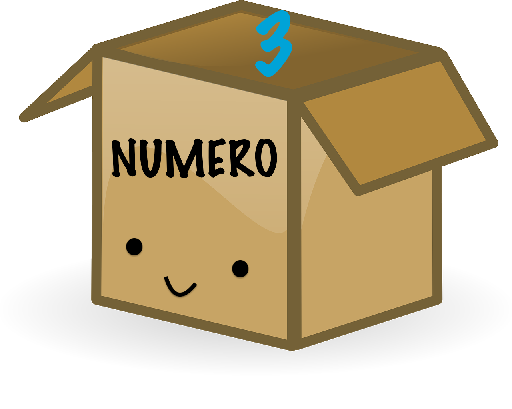
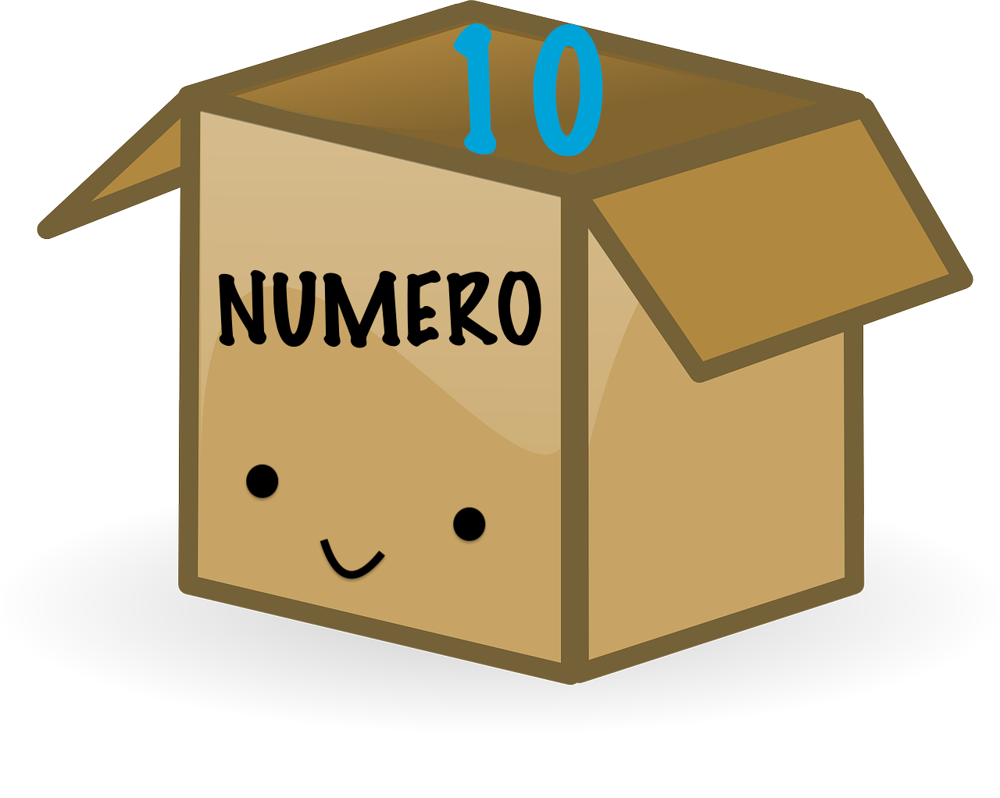
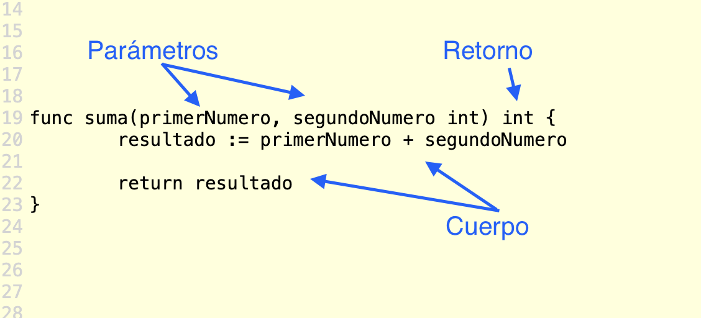

# Calculadora

Al final del reto habrás escrito un programa para una calculadora sencilla que puede sumar, restar y multiplicar. ¡Empecemos!

## Variables

Absolutamente todos los programas de mundo usan variables. Son una parte básica de la programación.

Una variable es un nombre que se le da a un valor. Ese valor puede ser un número, una palabra o lo que tu quieras.

```go
numero := 3
```

El ejemplo de arriba nos muestra una variable que se llama `numero`, y tiene un valor de `3`.

¿Pero porqué se llama variable? Pues porque el valor de la variable puede cambiar. Imagináte una caja a la que únicamente le puede caber una sola cosa, esta caja tiene un nombre. Se llama `numero` y decidimos que le vamos a meter un valor de `3` adentro.



En código esto se representa así:

```go
numero := 3
```

Haz click en este [enlace](https://play.golang.org/p/MyaaMRo9ZTn) y luego haz click en el botón "Run" como aprendiste al inicio del reto, para que puedas ver nuestra variable en el Go playground en acción.

Ahora supongamos que ya no necesitas el valor `3`. El valor que ahora necesitas es `10`. ¡No hay problema! Le puedes asignar un valor nuevo a la variable `numero`. En otras palabras sacas el valor `3` de la caja, y metes un valor nuevo de `10`.



En código esto se representa así:

```go
numero = 10
```

Como verás, cuando le asignamos un nuevo valor a la variable, la manera que se escribe es un poquito diferente. Ahora usamos `=` en vez de `:=`. La razón de esto es porque la variable `numero` ya existía desde antes.

En otras palabras, la primera vez que declaramos la variable con su valor usamos `:=`. Estamos creando la caja y le estamos poniendo un valor adentro.

Las siguientes veces que le asignemos un nuevo valor a una variable que ya existe usaremos `=`. Estamos volviendo a usar la misma caja pero le estamos cambiando el valor que tiene adentro.

Haz click en este [enlace](https://play.golang.org/p/Eu-aB5rnqVx) y dale click al botón "Run" para que veas como cambia el valor de nuestra variable `numero`.

## Funciones

Una función es algo así como un pequeña fabrica. Le das uno o varios valores, sigue un conjunto de instrucciones y al final te regresa algo diferente al valor inicial que le diste.


Estos tres elementos de la función tienen los siguientes nombres:

- **Parámetros**: Son los valores que tu le das que va a usar para crear el resultado final. (Estas son opcionales, hay funciones que no toman ningún valor y solamente te dan un resultado)
- **Cuerpo**: El cuerpo de la función es el código o pasos que va a tomar nuestra pequeña fabrica para crear algo nuevo.
- **Retorno**: ¡Este es el producto que creo nuestra fabrica! O en otras palabras, el resultado de la función.



En la primera linea del ejemplo puedes ver la palabra `func`, esta palabra aparece al principio para decirle a la computadora que estás creando una función.

Luego viene el nombre de la función. Al igual que las variables, las funciones también tienen un nombre. En este caso nuestra función se llama `suma`, pero le puedes poner lo que tu quieras.

Lo que va dentro de los paréntesis son los parámetros que le vamos a dar a nuestra función. Son variables que les llamamos `primerNumero` y `segundoNumero`. Verás que a lado hay una palabra chistosita `int`, estas tres letras representan la palabra "integer" que en español significa "numero entero". En Go es necesario declarar de que tipo son nuestras variables. En este caso vamos a sumar nuestras variables así que usaremos `int` o "números enteros".

Después de las paréntesis verás que de nuevo sale la palabra `int`. Esto significa que el retorno, o lo que vamos a crear es del tipo `int` o número entero.

El cuerpo de la función es donde pasa toda la magia. Primero le vamos a asignar a una variable el valor de la suma de las variables `primerNumero` y `segundoNumero`. Al final usaremos la palabra `return` que significa "retornar" para que retorne el valor de la variable `resultado`.

¡¡¡Uffff!!! Es mucho, tómate un respiro :sweat_smile:


Vayamos al Go playground para que veas como funciona todo esto. Verás que esta vez que vayas al Go playground, además de la función que acabamos de escribir, hay dos líneas nuevas de código en la función `main()` (esta función `main()` es necesaria en todos los programas de Go, es la función principal):

```go
func main() {
    resultadoFuncion := suma(8, 2)
    println(resultadoFuncion)
}
```

Primero verás que se le está asignando a la variable `resultadoFuncion` el valor del resultado de nuestra función `suma` al la que le estamos dando como parámetros los valores `8` y `2`.

Luego usamos una función que viene incluida en Go que se llama `println`, que representa "print line" que en español significa "imprime linea", esta va a imprimir el valor de nuestra variable `resultadoFuncion`.

Haz click en este [enlace](https://play.golang.org/p/Wj96F9Rib0E) y dale click a "Run" para que veas a nuestra función en acción. !Cambia los valores de los parámetros para que veas que pasa si usas otros números!

Puedes tener cuantas funciones quieras adentro de `main()`. Ahora agregaremos una función que multiplica. Haz click en este [enlace](https://play.golang.org/p/na8x5Y-Re1n) y dale click a "Run".

## Reto

Ahora que ya tienes las dos funciones de sumar y multiplicar, crea una tercera que reste dos números. Usa el Go playground y cuando termines haz click al botón "Share", copia el enlace que te sale y mándanoslo para que veamos tu programa. :tada:

### Reto extra

¿Que pasa si quieres sumar mas de dos números? Intenta modificar la función que suma a que sume 3 números :thinking:
